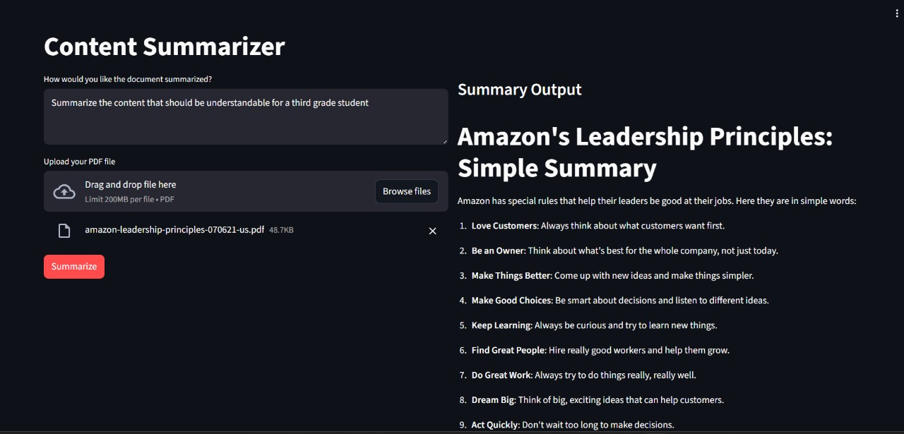

📄 Document Summarizer using Amazon Bedrock & Streamlit

(Built as part of the AI for Bharat – Powered by AWS Learning Program)

This project is a document summarization application originally developed during the AI for Bharat – Innovation Hack2Skill Program (Media Partner: YourStory).
The code in this repository is based on the official workshop lab materials, and I have made additional improvements to:

UI layout

File upload handling

Folder structure

Documentation

Architecture diagrams

This repository is intended for learning, reference, and demonstration only.

---

⚠️ Important: About AWS Billing

During the AI for Bharat workshop, we used a temporary, free, pre-configured AWS environment where Amazon Bedrock usage was covered by AWS.

Outside the workshop environment (i.e., on your own AWS account), Amazon Bedrock API calls are NOT free.
Running bedrock.converse() or generating summaries will incur charges.

📘 AWS Bedrock Pricing

🔗 https://aws.amazon.com/bedrock/pricing/

📘 Model Billing Details

🔗 https://docs.aws.amazon.com/bedrock/latest/userguide/pricing.html

To avoid unexpected charges:

Disable Bedrock model access

Set up AWS Budget Alerts

Or run the UI without calling the API

---

✨ Features

Upload PDF documents

Enter custom summarization instructions

AI-generated summaries from Amazon Bedrock

Clean, two-column Streamlit interface

Easy to run and extend

---

🧠 How It Works

1. Upload a PDF file

2. Streamlit reads the document and prompt

3. Backend sends bytes + instructions to Amazon Bedrock Converse API

4. Claude (Sonnet) analyzes content

5. Summary is generated and displayed

---

🧰 Tech Stack

Amazon Bedrock (Claude 3 Sonnet)

Converse API with Document-Chat

Python 3 & boto3

Streamlit

PDF byte processing

---

🏗 Architecture Diagram

(Add your architecture image here)

User → Streamlit App → summarization_lib.py → Amazon Bedrock → Summary Output

---

🖥 UI Preview

(Add your UI screenshot here)

---

📁 Project Structure

document-summarizer/
│
├── app/
│   ├── app.py                  # Streamlit UI
│   └── summarization_lib.py    # Bedrock logic
│
├── docs/
│   ├── Final UI.jpg
│   └── Archietecture.png
│
├── requirements.txt
├── .gitignore
└── README.md

---

▶️ How to Run Locally

⚠ Reminder: Running on your AWS account triggers real Bedrock charges.

pip install -r requirements.txt
aws configure
streamlit run app/app.py

---

🚀 Use Cases

Report summarization

Research paper insights

Meeting transcript summaries

Customer case analysis

Academic content simplification

---

📝 Attribution & Event Details

This project is derived from the Content Summarizer Lab taught during the:

AI for Bharat – Powered by AWS

Organized by: Innovation Hack2Skill
Media Partner: YourStory

The workshop provided:

Guided labs

Preconfigured Bedrock access

Educational sample code

I used the workshop’s base implementation and added modifications to improve:

Folder structure

UI design

Documentation

Readability

Architecture diagrams

This repository is not an official AWS product—it is an educational reconstruction and enhancement based on the training materials.

---

⭐ Support

If this project helped you, consider giving it a star ⭐ on GitHub!
